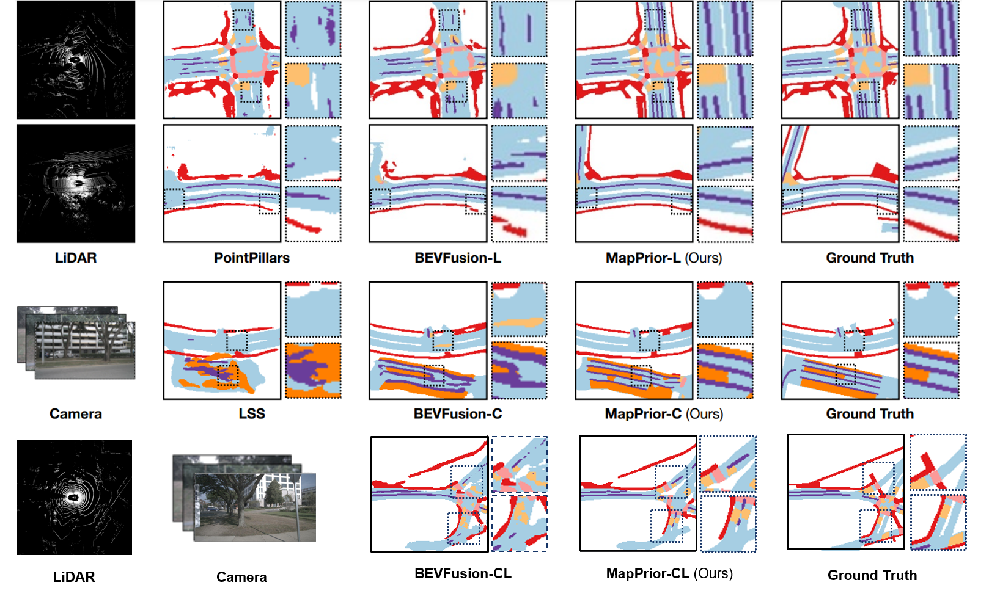

# MapPrior 
##### ICCV 2023

[**MapPrior: Bird’s-Eye View Map Layout Estimation with Generative Models**](https://link.to.paper/)<br/>
[Xiyue Zhu](https://link.to.paper/),
[Vlas Zyrianov](https://www.zyrianov.org/),
[Zhijian Liu](https://zhijianliu.com/),
[Shenlong Wang](https://shenlong.web.illinois.edu/) <br/>

**tl;dr** MapPrior is a novel BEV perception framework that combines a traditional discriminative BEV perception model with a learned generative model for semantic map layouts. It delivers predictions with better accuracy, realism and uncertainty awareness than its baselines.


[Paper](https://link.to.paper) | [BibTeX](#bibtex) | [Project Page](https://links.to.project/)


## Overview of pretrained models
The following table provides an overview of our models. 

|        Model         | Modality | mIoU | MMD | 
| :------------------: | :------: | :--: | :---: |
| [MapPrior_L](configs/cond_feature_L.yaml)       |   L    | 51.1 | 35.8 |
| [MapPrior_C](configs/cond_feature_C.yaml) |    C     | 56.7 | 28.4 |
| [MapPrior_CL](configs/cond_feature_CL.yaml)  |    C+L     | 63.1 | 28.0 |
| [MapPrior_L_one_step](configs/cond_feature_L_one_step.yaml)       |   L    | 50.0 | 50.2 |
| [MapPrior_C_one_step](configs/cond_feature_C_one_step.yaml) |    C     | 56.7 | 28.7 |
| [MapPrior_CL_one_step](configs/cond_feature_CL_one_step.yaml)  |    C+L     | 63.0 | 28.1 |


## Requirements
The code is based on [VQGAN](https://github.com/CompVis/taming-transformers/tree/master) and [BEVFusion](https://github.com/mit-han-lab/bevfusion) and requires the following libraries:

- Python >= 3.8, \<3.9
- OpenMPI = 4.0.4 and mpi4py = 3.0.3 (Needed for torchpack)
- Pillow = 8.4.0 (see [here](https://github.com/mit-han-lab/bevfusion/issues/63))
- [PyTorch](https://github.com/pytorch/pytorch) >= 1.9, \<= 1.10.2
- [torchpack](https://github.com/mit-han-lab/torchpack)
- [mmcv](https://github.com/open-mmlab/mmcv)==1.4.0
- [mmcv-full](https://github.com/open-mmlab/mmcv)==1.4.0
- [mmdet](http://github.com/open-mmlab/mmdetection)==2.20.0
- [nuscenes-dev-kit](https://github.com/nutonomy/nuscenes-devkit)
- numba==0.48.0
- numpy==1.23
- tqdm
- albumentations==0.4.3
- opencv-python==4.1.2.30
- pudb==2019.2
- imageio==2.9.0
- imageio-ffmpeg==0.4.2
- pytorch-lightning==1.0.8
- omegaconf==2.0.0
- test-tube>=0.7.5
- streamlit>=0.73.1
- einops==0.3.0
- more-itertools>=8.0.0
- transformers

After installing these dependencies, run the following commands to install MapPrior, a modified version of BEVFusion (under bev_lib folder), and to download pretrained MapPrior and BEVFusion models:

```bash
pip install -v -e .
cd bev_lib 
pip install -v -e .
cd ..
./scripts/download_pretrained.sh
./scripts/download_pretrained_bevfusion.sh
```
### Data Preparation

#### nuScenes

Download nuscenes to MapPrior/data. 

Next, prepare the dataset by running (see [this link](https://github.com/open-mmlab/mmdetection3d/blob/1.0/docs/en/datasets/nuscenes_det.md) for more details): 

```bash
python scripts/create_data.py nuscenes --root-path ./data/nuscenes --out-dir ./data/nuscenes --extra-tag nuscenes
```

After data preparation, you will have the following directory structure:

```
MapPrior
├── data
│   ├── nuscenes
│   │   ├── maps
│   │   ├── samples
│   │   ├── sweeps
│   │   ├── v1.0-test
│   |   ├── v1.0-trainval
│   │   ├── nuscenes_database
│   │   ├── nuscenes_infos_train.pkl
│   │   ├── nuscenes_infos_val.pkl
│   │   ├── nuscenes_infos_test.pkl
│   │   ├── nuscenes_dbinfos_train.pkl

```


#### Saved maps [Optional]
We save nuscenes maps instead of rendering it on the fly using nuscenes data loader to accelerate the training. Please download the saved maps for both [training set](https://uofi.box.com/s/vi16hr2ifklnzgmzktpv1e0a0s3pm05s) and [validation set](https://uofi.box.com/s/7aa6ba1tf0jpjg5c1nwzbifypbol4psh) and put it under MapPrior/data. This is needed only when training a VQGAN autoencoder from scratch. Alternatively, we provide a script to download all the checkpoint files using wget.

```bash
./download_saved_map.sh
```

## Running pretrained models
Please download pretrained models using this [link](https://uofi.box.com/s/1auka500ppc1qet3pxchlgdacxci6toj) . Alternatively, we provide a script to download all the checkpoint files using wget.
```bash
./scripts/download_pretrained.sh
```

Then use this command to run inference and save the results to a folder
```bash
python ./scripts/transformer.py --base [config_path] --resume [checkpoint_path] --save [folder_to_save_results] -t True --gpus 0,
```

For example, to save the results for MapPrior-L under the folder MapPrior_L_results using the downloaded checkpoint:

```bash
python ./scripts/transformer.py --base configs/cond_feature_L.yaml --resume pretrained_models/MapPrior_L --save MapPrior_L_results -t True --gpus 0,
```

To calculate IOU and MMD, run 
```bash
python ./scripts/test_metrics.py -s [folder_to_save_results]
```
Here [folder_to_save_results] is the folder where you saved your results in the last command, e.g. "MapPrior_L_results".

## Training models
To train the first stage model, an autoencoder built on the ground truth map, use this command. (Use --gpus flags when using multi-gpu. For example, use "--gpus 0,1,2,3" when using 4 gpus)
```bash
python ./scripts/train_autoencoder.py --base configs/custom_vqgan.yaml -t True --gpus 0,
```
The model file and the training logs will be saevd in MapPrior/logs/custom_vqgan. To use the model in the second stage, move the logs to pretrained models or modify the path in the second stage config file.

```bash
mv logs/custom_vqgan pretrained_models/autoencoder
``` 


To train the second stage models from scrath, use this command:

```bash
python ./scripts/transformer.py --base [config_files] -t True --gpus 0,
```

For example:
```bash
python ./scripts/transformer.py --base configs/cond_feature_L.yaml -t True --gpus 0,
```

Again, the model checkpoint is saved under logs, to save results using the second stage model, run the same command from Running [pretrained models](<#Running pretrained models>) but change the checkpoint_path to the saved checkpoint.

For example,
```bash
python ./scripts/transformer.py --base configs/cond_feature_L.yaml --resume pretrained_models/cond_feature_L --save MapPrior_L_results -t True --gpus 0,
```

## Acknowledgements
The architecture of our Model is inspired by [VQGAN](https://github.com/CompVis/taming-transformers/tree/master) and [BEVFusion](https://github.com/mit-han-lab/bevfusion)

## BibTeX

```
@misc{zhu2023mapprior,
      title={MapPrior: Bird’s-Eye View Perception with Generative Models}, 
      author={Xiyue Zhu and Vlas Zyrianov and Zhijian Liu and Shenlong Wang},
      year={2023},
      booktitle={ICCV},
}
```
